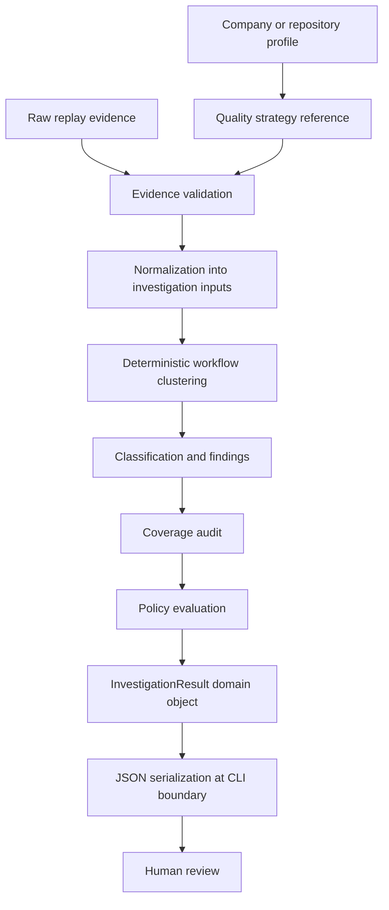

# Quality Strategy Architecture

QA Agents does not assume every software organization evaluates quality through the same evidence, thresholds, or decision rules. The strategy layer separates the investigation pipeline from the quality model applied to it, so the same agents can reason over different evidence sources while preserving explicit, testable policy boundaries.

## 1. Context

The repository already had profiles before strategies were introduced. Profiles answer questions about the system being investigated: what application or repository conventions apply, which routes or commands matter, which integrations exist, and where tests or tracker metadata live. They are identity and context objects.

Profiles did not adequately answer a different set of questions:

- what evidence is considered authoritative;
- how evidence should be classified;
- which safety boundaries apply;
- how a merge recommendation should be derived;
- how different quality philosophies change agent behavior.

Embedding those rules directly inside the investigation pipeline would make the pipeline branch by company, repository, or vendor. That would be hard to test, hard to extend, and easy to turn into implicit policy. The strategy abstraction makes the quality model explicit.

```text
Profile:
Who or what is being investigated.

Quality strategy:
How evidence is interpreted and how decisions are constrained.
```

A company or repository profile may reference a quality strategy, but they are not the same abstraction. A profile says which target is under investigation. A strategy says how evidence from that target should be interpreted.

## 2. Design Goals

The strategy architecture is designed to:

- keep the core investigation pipeline stable;
- make quality behavior strategy-driven rather than hardcoded;
- preserve deterministic evidence as the source of truth;
- retain traceability from findings back to evidence;
- make classifications and policies testable;
- keep human authority over final decisions;
- allow future strategies without introducing a large plugin framework;
- fail with useful errors when evidence is malformed.

The non-goals are equally important:

- building a general-purpose plugin ecosystem;
- reproducing a browser replay engine;
- allowing configuration to execute arbitrary code;
- letting probabilistic output bypass deterministic safety rules;
- supporting every possible evidence model immediately.

## 3. Architectural Overview



The current CLI path is implemented by `qa_agents.__main__`, which dispatches `python3 -m qa_agents investigate` to `qa_agents.investigate`. The CLI parses arguments, calls `run_investigation`, and serializes the final artifact as JSON. It is intentionally thin.

The strategy engine in `qa_agents.strategies` owns strategy loading, policy loading, evidence validation, workflow clustering, classification, coverage audit, policy evaluation, summary generation, and final serialization. Raw evidence enters as JSON. Internally, the investigation uses typed dataclasses. JSON is produced only at the command boundary.

## 4. Strategy Registry and Discovery

`StrategyRegistry` is a small filesystem-backed discovery boundary. It looks under the configured strategies root and considers a strategy available when a directory contains `strategy.yaml`.

The current convention is:

```text
strategies/<strategy-id>/
```

This matches the repository's existing profile pattern: public-safe, inspectable files checked into the repo. The CLI should not discover or parse strategies itself. Keeping discovery in `StrategyRegistry` gives the code one stable place to evolve if future strategies come from another source.

The implementation deliberately avoids a complex plugin system. Strategy IDs are validated by `load_strategy`: the `id` in `strategy.yaml` must match the directory name. Unknown strategy errors include the available strategy IDs, and malformed strategy fields raise `StrategyError` with actionable messages.

The current `strategies/meticulous/` directory contains:

- `strategy.yaml`
- `decision-policy.yaml`
- `evidence-schema.json`
- `prompts/`
- `fixtures/pricing-change.input.json`
- `examples/pricing-change.investigation.json`
- strategy-specific tests
- `README.md`

Only `strategy.yaml`, `decision-policy.yaml`, and the input evidence are loaded by the current engine. The schema, prompts, examples, and README document the strategy and support testing or demonstration.

## 5. Strategy-Driven Behavior

The initial strategy work is intentionally strategy-shaped, and the review tightened the boundary between configuration and Python behavior. That is an architectural refinement, not a failure: the system starts with a specific replay-oriented strategy, then moves the durable policy choices into bounded configuration.

`StrategyBehavior` is the internal object produced from policy configuration. It currently carries:

- clustering features;
- classification rules;
- summary next actions.

`ClassificationRule` describes a bounded matching rule over deterministic difference fields, such as `diff_type`, `expected`, `severity`, and whether known expectation evidence is required.

```text
Configuration defines:
- which evidence features matter;
- how findings are classified;
- which decision rules apply;
- which next actions are attached.

Python implements:
- loading;
- validation;
- normalization into domain objects;
- clustering mechanics;
- rule evaluation;
- serialization.
```

The system is not fully generic in every respect. The current validation function is replay-evidence-specific and requires simulated replay source metadata. That is acceptable for the first strategy. Future strategies should extend the bounded configuration model only when a second real quality environment exposes a genuine abstraction need.

## 6. Deterministic Evidence Before Probabilistic Reasoning

The central principle is:

> Deterministic systems produce evidence. Probabilistic systems interpret evidence. Policy constrains recommendations. Humans retain authority.

The architecture does not put an LLM inside replay execution, evidence capture, or timing-sensitive browser behavior. Replay evidence is expected to be produced by deterministic systems that can rerun sessions, compare base and head behavior, and emit stable differences. QA Agents then investigates the evidence downstream.

This separation improves repeatability, debuggability, false-positive control, reproducible tests, evidence provenance, and reviewability. If a finding is wrong, engineers can inspect the raw session, difference IDs, branch references, and policy metrics instead of reverse-engineering an opaque judgment.

Probabilistic reasoning can still be useful for synthesizing related findings, explaining impact, and proposing next actions. It must not rewrite the underlying evidence or override explicit policy. In the current implementation, the investigated artifact is produced deterministically from the fixture and policy configuration.

## 7. Immutable Evidence and Derived Findings

Raw evidence remains immutable because investigation should not alter the source of truth to fit a conclusion.

```text
Raw evidence
    ↓
Validated and normalized evidence
    ↓
Derived clusters and findings
    ↓
Policy decision
    ↓
Serialized investigation artifact
```

Processors may create derived objects such as `WorkflowCluster`, `DifferenceFinding`, `CoverageFinding`, and `PolicyDecision`. They should not rewrite source sessions, differences, branches, or coverage records.

This preserves auditability and reproducibility. It also allows alternative interpretations to be compared against the same evidence. Every significant finding retains evidence references through fields such as `session_ids`, `diff_ids`, `branch_ids`, and `workflow_cluster_ids`. Clusters also retain `evidence_refs`, currently the session IDs that contributed to the cluster.

## 8. Workflow Clustering as a First-Class Stage

Session-level evidence is often too granular for human review. Replay systems can identify many affected sessions, but one session is not necessarily one workflow or one issue.

```text
Session != Workflow != Issue
```

Multiple sessions may represent the same user workflow, the same root regression, or repeated manifestations of one product change. Treating all sessions as separate issues would inflate the review burden and obscure shared causes.

The current implementation clusters affected sessions before classification synthesis. `cluster_workflows` uses strategy-provided `clustering_features`, currently `workflow_hint` and `route_sequence`. It also derives shared routes, shared covered branches, shared difference signatures, evidence references, and a simple confidence score.

```text
17 affected sessions
-> 3 workflow clusters
-> 1 confirmed regression and 1 expected product-change group
```

This improves reviewer comprehension, duplicate suppression, root-cause analysis, actionability, and evidence traceability. The raw session IDs remain available, but the review artifact is organized around workflows.

## 9. Typed Domain Objects

The strategy layer currently uses these internal dataclasses:

- `QualityStrategy`
- `StrategyRegistry`
- `ClassificationRule`
- `StrategyBehavior`
- `WorkflowCluster`
- `DifferenceFinding`
- `CoverageFinding`
- `PolicyDecision`
- `InvestigationResult`

Serialization is moved to the boundary through `investigation_to_dict`.

```text
Preferred:
typed domain objects -> boundary serialization -> JSON

Avoided:
dictionary -> dictionary -> dictionary throughout the pipeline
```

Typed domain objects make invariants clearer, improve maintainability, reduce key-name errors, and make the code easier to test. They also make future type checking easier, although the repository does not currently claim mypy enforcement.

## 10. Policy-Constrained Decisions

A finding and a decision are different things.

```text
Finding:
A deterministic functional difference exists in two sessions.

Policy:
Any confirmed functional regression requires a hold decision.

Decision:
Hold.
```

The final recommendation should not be an unconstrained model judgment. `apply_decision_policy` computes deterministic metrics from the investigation, evaluates policy rules, and selects the highest-priority matching rule. If no rule matches, the system falls back to `requires_human_review`.

```text
Reasoning proposes.
Policy constrains.
Human decides.
```

Rules should be explicit, deterministic, ordered or prioritized, testable, and inspectable in the generated artifact. Current policy decisions such as `hold`, `merge_with_acknowledged_change`, and `requires_human_review` are workflow recommendations. They are not autonomous merge authority, and the output sets `human_decision_required` to `true`.

## 11. Validation and Failure Behavior

The validation boundary exists before investigation. `load_evidence` parses JSON and verifies that the file contains an object. `validate_replay_evidence` checks required top-level fields, simulated replay source metadata, session structure, unique session IDs, workflow hints, route sequences, difference IDs, and deterministic difference flags.

Malformed evidence should produce concise, actionable CLI errors rather than raw stack traces. The current CLI catches `StrategyError` and prints errors in this shape:

```text
qa-agents investigate: Invalid evidence for strategy 'meticulous':
  - missing top-level field: case_id
  - source must be an object
  - sessions[0] missing session_id
```

Useful failures matter because strategy authors can correct fixtures quickly, integration failures are easier to diagnose, users are not exposed to internal exceptions, and malformed data cannot silently produce misleading conclusions.

## 12. Current Meticulous-Inspired Strategy

The Meticulous-inspired strategy is the first proof of the architecture, not the reason the architecture exists. It is based on public replay-testing concepts, uses simulated evidence, is not an official integration, and does not use private APIs or data.

It demonstrates:

- replay-first evidence;
- deterministic workflow clustering;
- expected-change versus regression classification;
- coverage-gap detection;
- policy-constrained merge recommendation.

The committed fixture and example artifact currently show:

```text
17 affected sessions
3 workflow clusters
1 expected product change
1 confirmed regression
1 uncovered branch
Decision: hold
```

The strategy is intentionally public-safe. The source evidence identifies itself as `simulated_replay_platform`, marks `simulated` as `true`, and includes a disclaimer that it was not produced by Meticulous.

## 13. Extensibility

A future strategy could alter accepted evidence types, clustering inputs, classification rules, coverage expectations, decision policies, and summary next actions.

Illustrative examples:

```text
Accessibility-first:
prioritize semantic and keyboard evidence.

Fintech:
treat payment calculation differences as high severity.

API-first:
cluster failures by endpoint and contract change.

Safety-critical:
require stronger evidence completeness and mandatory human review.
```

Future strategies should not require branches such as:

```python
if strategy_id == "fintech":
    ...
```

unless a genuinely strategy-specific algorithm cannot be expressed through the bounded configuration model. The architecture should evolve when another real strategy exposes a concrete abstraction need, not because an imagined plugin framework might be useful later.

## 14. Tradeoffs and Limitations

Filesystem-backed configuration is simple and inspectable, but it is not intended for remote strategy distribution. That is a good tradeoff for this repository today.

Policy configuration can become difficult to validate if it grows without bounds. The current parser supports JSON policy files and a small subset of YAML-style strategy metadata; it is not a general YAML platform.

Not every quality model will fit the current clustering algorithm. The Meticulous-inspired strategy clusters affected sessions by workflow and route features, which is appropriate for replay evidence. API-first or accessibility-first strategies may need different mechanics.

Strategy-driven behavior still depends on a generic Python execution engine. Typed objects improve structure, but static type checking is not currently enforced by mypy. One implemented strategy is not proof that every future strategy will fit cleanly. Policy quality also depends on the quality of its rules and evidence inputs.

## 15. Testing Approach

The current tests cover the strategy layer through:

- strategy loading;
- config-driven classification;
- config-driven summary actions;
- evidence normalization;
- deterministic workflow clustering;
- decision policy;
- malformed evidence errors;
- CLI artifact generation through existing CLI tests;
- preservation of the expected fixture result.

The strategy-specific tests live under `strategies/meticulous/tests/`. Broader CLI behavior is covered by root tests under `tests/`.

The requested verification commands are:

```bash
.venv/bin/python -m pytest
.venv/bin/python -m compileall qa_agents
```

Ruff and mypy are not currently configured as passing project checks.

## 16. Decision Record

| Decision | Rationale |
| --- | --- |
| Separate strategies from profiles | Identity and evidence philosophy are different concerns |
| Filesystem-backed registry | Matches the existing repository and avoids premature plugin complexity |
| Deterministic clustering first | Produces reproducible, explainable grouping before synthesis |
| Immutable raw evidence | Preserves auditability and provenance |
| Typed internal domain objects | Keeps invariants clear until boundary serialization |
| Policy-constrained recommendations | Prevents unconstrained probabilistic decisions |
| Human final authority | The system assists investigation; it does not autonomously merge |
